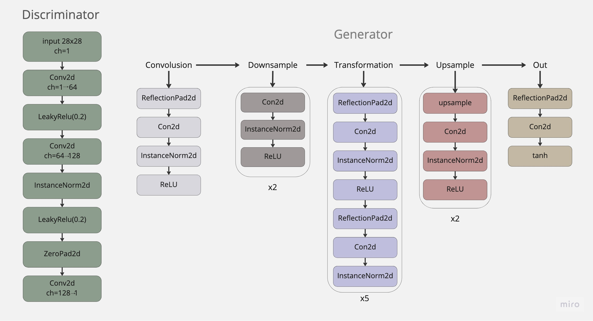
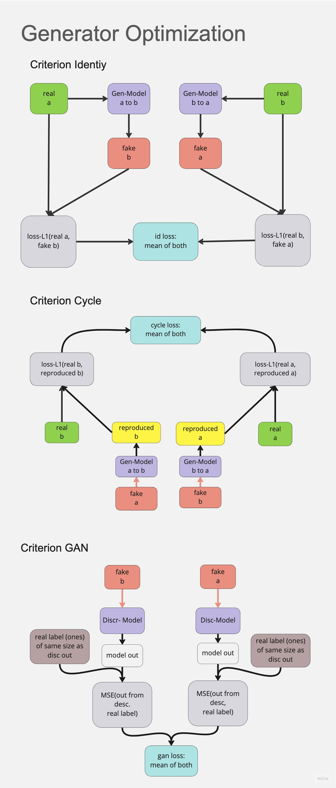
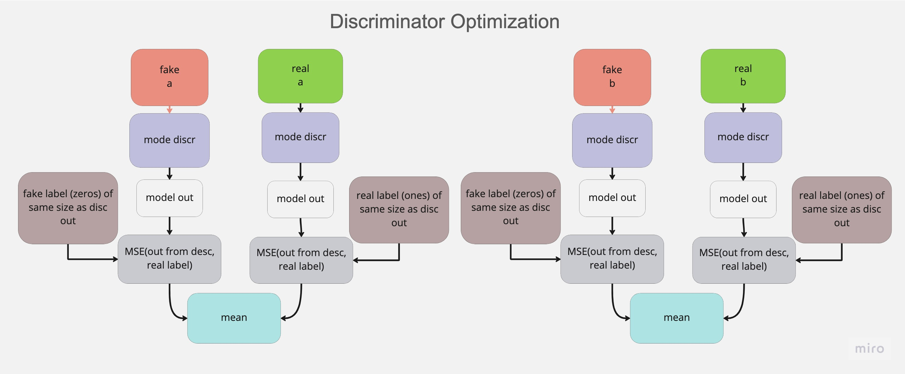

# Cycle GAN
- Cycle GAN using 28x28 image of alphabets
- The implementation generates 28x28 images of 'A's from images of 'B's of the same size, and vice versa
- Convolusion is used on both Generator and Discriminator
#### Models
- Here we create 2 instances of generative and discriminative models
    -  Generator for A to B generation
    -  Generator for B to A generation
    -  Discriminator for classifying fake and areal A's
    -  Discriminator for classifying fake and real B's

#### Optimizations
- The generator is optimized using 3 loss functions
    -  Mean L1 Loss between real image and produced fake image from both the networks
    -  Mean L1 Loss between real images and reproduced versions of real images from fake images on both the generative networks this is the cycle loss
    -  Mean MSE Loss between disriminator output of fake images and real labels,here real labels are ones and fake labels are zeros 

- All the threee losses combined to optimize the generator network weights which includes two generator models,one for A to B generation and other one for B to A generation
- Two separate classifiers/discriminators trained to classify inputs into  A or not A, and B or not B 
- These models are trained with supervision with real and fake data with curresponding labels as ones and zeros

